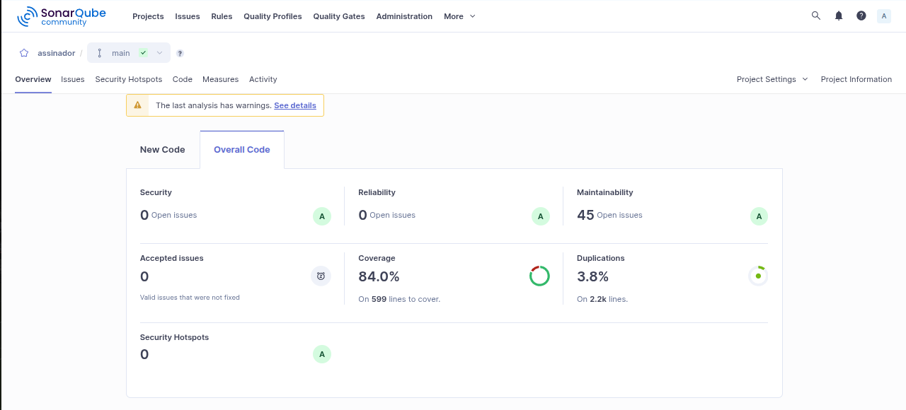

# Relatório de Cobertura

Relatórios semanais gerados a partir da análise do SonarQube Community Edition rodando localmente via Docker Compose.

---

## Semana 1 — 02/06/2026

### Testes

| Tipo | Quantidade |
|---|---|
| Unitários | 155 |
| Integração | 0 |

### Cobertura

